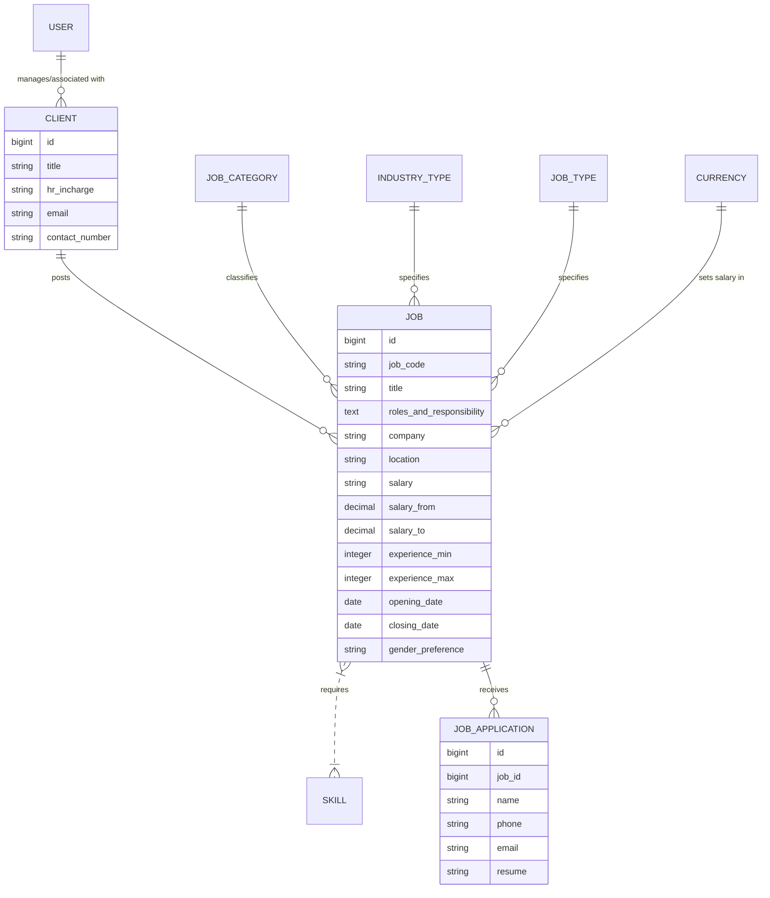
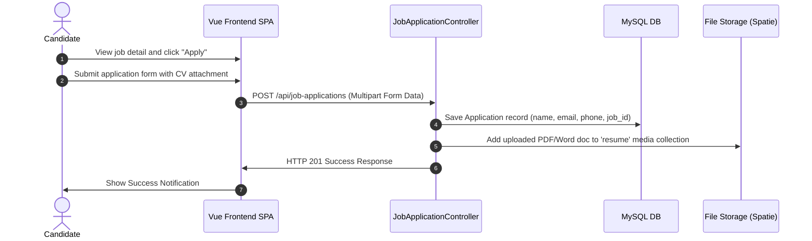

# Project Structure & Architecture: Best4You (B4U)

This document provides a comprehensive guide to the directory organization, module architecture, database relationships, routing schemas, and standard coding workflows of the Best4You (B4U) project. It serves as a developer guide to help navigate, track, and extend the codebase.

---

## 1. High-Level Architecture Overview

Best4You is built as a hybrid application that integrates a robust PHP backend and two distinct frontend architectures:
1. **Laravel 12 Backend**: Serves as a RESTful JSON API provider (`routes/api.php`) and manages authentication, media storage, permissions, and database operations. It also serves traditional **Laravel Blade Views** (`routes/web.php`) for public-facing pages and a dashboard.
2. **Vue 3 Frontend SPA (Single Page Application)**: Located in the `src/` folder, this SPA features **Vuetify 3** and custom templates to provide interactive experiences for both visitors and administrators.
   - **Admin Sub-App**: A complete management dashboard (adapted from the Sneat admin layout) where admins can manage jobs, view statistics, process applications, and configure metadata (skills, clients, currencies, etc.).
   - **Frontend Sub-App**: Visitor-oriented SPA pages for viewing job listings, details, services, contact forms, and submitting applications.

---

## 2. Directory Structure

Below is the directory breakdown of the project:

```
best4-you/
├── app/                        # Core Laravel backend application code
│   ├── Http/
│   │   └── Controllers/        # PHP controllers (API endpoints & Blade controllers)
│   ├── Models/                 # Eloquent database models
│   ├── Providers/              # Application service providers (auth, routing, etc.)
│   └── Traits/                 # Reusable traits
├── bootstrap/                  # Laravel bootstrap files
├── config/                     # Application config files (auth, databases, storage, etc.)
├── database/                   # Database migrations, seeders, and factories
│   └── migrations/             # Database schema definition files
├── public/                     # Publicly accessible folder
│   └── frontend/               # Public assets (icons, stylesheets, templates)
├── resources/                  # Laravel views and styling
│   └── views/                  # Blade templates (for traditional pages)
│       ├── admin/              # Blade views for admin pages
│       ├── frontend/           # Blade views for guest pages
│       └── layouts/            # Shared Blade layout templates
├── routes/                     # Application routes
│   ├── api.php                 # API endpoints (used by Vue SPA and third-party tools)
│   └── web.php                 # Web endpoints (serving Blade views)
├── src/                        # Vue 3 Single Page Application (SPA) codebase
│   ├── admin/                  # Admin portal dashboard codebase (Vuetify, Sneat theme)
│   │   ├── @core / @layouts    # Core Vuetify template structures
│   │   ├── assets/             # Admin stylesheets, images, icons
│   │   ├── components/         # Custom form components (editors, text fields, drops)
│   │   ├── composables/        # Shared Vue composables (e.g., useAuth.js)
│   │   ├── layouts/            # Dashboard layout configurations
│   │   ├── pages/              # Admin pages (Jobs.vue, Clients.vue, Users.vue, etc.)
│   │   ├── plugins/            # Vuetify, Pinia, webfontloader plugins
│   │   ├── router/             # Sub-routes configuration for Admin
│   │   └── views/              # UI widgets and sub-sections (e.g. dashboards tables)
│   ├── frontend/               # Customer storefront/pages codebase
│   │   ├── layouts/            # Visitor-facing layout configurations
│   │   ├── pages/              # Pages (Home.vue, Jobs.vue, JobDetails.vue, About.vue)
│   │   └── router/             # Sub-routes configuration for Frontend
│   ├── router/                 # Main Vue Router coordinating admin/frontend routing
│   ├── App.vue                 # Root Vue Component containing `<router-view>`
│   └── main.js                 # Frontend SPA bootstrap file
├── components.d.ts             # Auto-generated Vue component typescript definitions
├── composer.json               # PHP backend dependencies and setup commands
└── phpunit.xml                 # Backend testing suite configuration
```

> [!NOTE]  
> The project repository root currently does not contain standard frontend bundler files like `package.json` or `vite.config.js`. If building the Vue 3 SPA locally, ensure you coordinate with the deployment setup or recreate the build configuration.

---

## 3. Database Architecture & Models

The system centers around **Jobs**, **Clients**, and **Job Applications**, using a database schema structured as follows:



### Model Definitions (`app/Models/`)

*   **[User.php](file:///Users/tijotitus/Projects/b4u/best4-you/app/Models/User.php)**: Represents administrative and recruitment users. Authenticated via Laravel Sanctum for the SPA and standard session auth for Blade. Uses `Spatie\Permission\Traits\HasRoles` to manage access control.
*   **[Job.php](file:///Users/tijotitus/Projects/b4u/best4-you/app/Models/Job.php)**: The central business model containing postings. Details include job codes, location, salary ranges, and opening/closing active window dates.
*   **[Client.php](file:///Users/tijotitus/Projects/b4u/best4-you/app/Models/Client.php)**: Stores organization profiles posting the jobs, including HR names, emails, and contact coordinates.
*   **[JobApplication.php](file:///Users/tijotitus/Projects/b4u/best4-you/app/Models/JobApplication.php)**: Represents submissions by candidates. Integrates Spatie Media Library (`InteractsWithMedia`) to attach candidate CVs/resumes under the `'resume'` media collection.
*   **[JobCategory.php](file:///Users/tijotitus/Projects/b4u/best4-you/app/Models/JobCategory.php)**: Classifies jobs into functional groups (e.g. IT, Healthcare) and stores display symbols/icons.
*   **[IndustryType.php](file:///Users/tijotitus/Projects/b4u/best4-you/app/Models/IndustryType.php)**: Represents industry sectors (e.g. Manufacturing, Retail).
*   **[JobType.php](file:///Users/tijotitus/Projects/b4u/best4-you/app/Models/JobType.php)**: Distinguishes Full-time, Part-time, Contract, or Internship options.
*   **[Skill.php](file:///Users/tijotitus/Projects/b4u/best4-you/app/Models/Skill.php)**: A many-to-many relationship mapping skills to job listings.
*   **[Currency.php](file:///Users/tijotitus/Projects/b4u/best4-you/app/Models/Currency.php)**: Handles regional currency symbols and metadata.

---

## 4. Routing & Controllers

Routing is partitioned into standard Blade routes (`web.php`) and API endpoints (`api.php`).

### A. Web Routes (`routes/web.php`)
These handle traditional server-rendered template views for the guest website:
*   **Guest Landing**:
    *   `/` -> [FrontendController@home](file:///Users/tijotitus/Projects/b4u/best4-you/app/Http/Controllers/FrontendController.php) (Home page)
    *   `/about`, `/services`, `/contact`, `/upload-resume`
    *   `/jobs` & `/jobs/{job_code}` (Public job listing directory with filters)
*   **Auth and Admin Views**:
    *   `/admin/login` -> AuthController login views and actions
    *   `/admin/*` -> Grouped under `'auth'` middleware, maps standard CRUD resource controllers (e.g. `JobController`, `ClientController`) returning traditional HTML Blade tables and edit pages.

### B. API Routes (`routes/api.php`)
These serve as the data layer backing the Vue 3 SPA frontend:
*   **Authentication (Unprotected)**:
    *   `POST /api/auth/register` & `POST /api/auth/login`
*   **Public Data (Unprotected)**:
    *   `GET /api/jobs`, `GET /api/jobs/{id}` (Fetches jobs checking open/closing windows)
    *   `POST /api/job-applications` (Submits a job application and media attachment)
    *   `GET` listing routes for Job Categories, Clients, Skills, Currencies, Industry/Job Types.
*   **Protected Resource Actions (Middleware `auth:sanctum`)**:
    *   `GET /api/user` -> Returns authenticated user profile, active roles, and permissions.
    *   `GET /api/dashboard/stats` -> Returns counters for Jobs, Applications, Clients, and Categories.
    *   `apiResource` CRUD endpoints (excluding public index) to edit metadata and listings.

---

## 5. Coding Structure & Workflows

### A. Candidate Application Flow



1.  **Frontend**: The candidate navigates the list of jobs in `src/frontend/pages/Jobs.vue`. Clicking one loads detail cards (`src/frontend/pages/JobDetails.vue`), opening the application modal.
2.  **API Submission**: The form posts payload parameters to `POST /api/job-applications` (or `/apply` on traditional views).
3.  **Controller Action**: [JobApplicationController@store](file:///Users/tijotitus/Projects/b4u/best4-you/app/Http/Controllers/JobApplicationController.php) validates inputs:
    *   Creates a `JobApplication` instance.
    *   Invokes `$application->addMediaFromRequest('resume')->toMediaCollection('resume')` storing the CV files.
4.  **Admin Alerts**: The application is immediately logged and appears on the admin panel.

---

### B. Admin CRUD & Authorization Workflow

Management of listings and metadata is protected by role-based access controls.

1.  **SPA Auth Guarding**:
    *   `src/router/index.js` checks target route meta tags. If the route contains `meta: { requiresAuth: true }`, a navigation guard executes a request to `axios.get('/user')`.
    *   If authentication fails, the application redirects the user to `/admin/login`.
2.  **Permission Resolution**:
    *   The composable `useAuth.js` caches user state along with authorization roles and permission lists.
    *   Vue views selectively display actions (e.g. Delete/Edit buttons) using permissions check. For example, `hasPermission('delete-jobs')`.
3.  **Backend Verification**:
    *   API endpoints enforce matching verification middleware. Requests lacking valid Sanctum tokens or session cookies fail with `HTTP 401 Unauthorized`.

---

## 6. Developer Guidelines & Cheat Sheet

*   **To Add a Database Column**:
    1.  Create a migration: `php artisan make:migration add_xyz_to_jobs_table`.
    2.  Implement `up()` and `down()` modifications.
    3.  Update the Eloquent Model `$fillable` array in `app/Models/Job.php`.
    4.  Expose the column in the corresponding Controller response or API Resource mapping.
*   **To Update Admin SPA Pages**:
    1.  Locate pages within [src/admin/pages/](file:///Users/tijotitus/Projects/b4u/best4-you/src/admin/pages).
    2.  To tweak layouts or edit schemas, modify the Vue templates which utilize standard Vuetify components (`v-card`, `v-data-table`, `v-dialog`).
*   **To Access Attached Resumes**:
    *   Always use `$application->resume_url` (derived via `$this->getFirstMediaUrl('resume')`) rather than hardcoding the public file path.

---

## 7. Data Listing & DataTable Architecture

All database listings in the admin panel utilize the `yajra/laravel-datatables` package coupled with the **DataTable Service Class** pattern to ensure clean, separation-of-concerns-focused code.

### Guidelines for Creating New Listings:
1. **Generate the DataTable class**:
   Run the following artisan command:
   ```bash
   php artisan datatables:make ModelNamesDataTable
   ```
2. **Configure the Service Class** (`app/DataTables/ModelNamesDataTable.php`):
   - Define relationships and query filters inside `query()`.
   - Format specific cells (e.g. badges, custom HTML actions, or formatted dates) in the `dataTable()` method using `editColumn()` and `addColumn()`.
   - Wrap interactive actions (Copy, Edit, Delete) in a dedicated Blade view file under `resources/views/admin/models/partials/actions.blade.php` and load it via `view()->render()`.
3. **Controller Setup**:
   Inject the DataTable class into your controller's `index()` method and delegate rendering:
   ```php
   public function index(Request $request, ModelNamesDataTable $dataTable)
   {
       if ($request->wantsJson() && !$request->ajax()) {
           return response()->json(ModelName::latest()->get()); // API fallback
       }
       return $dataTable->render('admin.models.index');
   }
   ```
4. **Blade View Setup** (`resources/views/admin/models/index.blade.php`):
   - Include `{!! $dataTable->table(['class' => 'table table-hover mb-0', 'id' => 'modelTable']) !!}` in the layout structure.
   - Include `{!! $dataTable->scripts() !!}` inside `@push('scripts')`.
   - Bind search accordion inputs to trigger redraw:
     ```javascript
     $('#searchForm input, #searchForm select').on('keyup change input', function () {
         window.LaravelDataTables["modelTable"].draw();
     });
     ```

